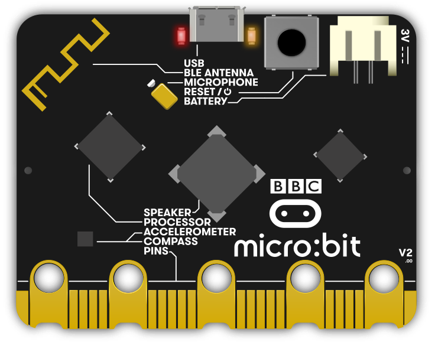

# Microbit

Microbit is an educational development board developed by the BBC

  * <https://microbit.org>

## Version 1.3

Currently I have a version 1.3 to play around with.

  * <https://tech.microbit.org/hardware/1-3-revision/>
  * 5 x 5 LED matrix
  * Magnetometer - Freescale MAG3110
  * Accelerometer - Freescale MMA8653FC
  * 2.4Ghz Bluetooth

### Main Processor

The main processor is a `NRF51822-QFAA-R rev3`

  * <https://www.digikey.com/en/products/detail/nordic-semiconductor-asa/NRF51822-QFAA-R/4691710>
  * <https://mm.digikey.com/Volume0/opasdata/d220001/medias/docus/6470/NRF51822-QFAA-R.pdf>
  * ARM Cortex-M0 32 bit processor
  * 256kB Flash, 16kB RAM
  * On board temperature sensor
  * I2C, SPI, UART
  * 8/9/10 bit ADC - 8 configurable channels

Outside of bluetooth it suggests other 2.4Ghz protocols may be possible as well
such as ANT, Enhanced ShockBurst. Microbit protocol

### Secondary Processor / USB / JTag Interface

There's also a secondary processor the `MKL26Z128VFM4`

  * <https://www.nxp.com/part/MKL26Z128VFM4>
  * Kinetis KL26: ARM Cortex-M0+ 48MHz
  * Ultra-Low Power MCU
  * 128KB Flash, 16KB SRAM, Full-Speed USB, 32-QFN
  * Acts as a CMSIS-DAP Jtag Interface
  * MSC USB Storage Interface for uploading code via a USB drive / storage method to the main cpu flash
  * Uart USB Interface

